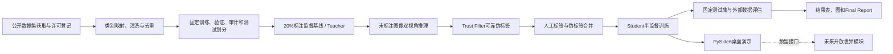

# Semi-Supervised Multi-Class Fruit Object Detection Using Reliable Pseudo-Labels

## 1. 文档目的

本文档固化半监督多类别水果目标检测科研实验与演示原型的已批准设计，作为后续实施计划、代码开发、实验执行和 Final Report 写作的共同依据。

本项目采用 Windows 原生环境，在单张 NVIDIA RTX 3080 10GB 显卡上完成。第一版本实现五类已知水果的半监督目标检测，不实现开放世界未知类别发现；代码和数据结构中保留后续开放世界扩展接口。

## 2. 项目目标与边界

### 2.1 核心目标

- 使用少量人工标注数据和较多未标注数据训练水果目标检测模型。
- 已知类别固定为 Apple、Banana、Orange、Strawberry 和 Pineapple。
- 建立 10%、20%、40% 和 100% 标注预算下的监督学习参照。
- 以 20% 标注数据训练 Teacher，并通过离线伪标签训练 Student。
- 实现可解释的可靠性过滤机制（Trust Filter），减少错误伪标签。
- 在固定测试集上取得最终三随机种子平均 `mAP@0.5 >= 0.80`。
- 最终半监督模型相对 20% 监督基线的平均 `mAP@0.5` 至少提高 3 个百分点。
- 提供可在 Windows 上运行的 PySide6 桌面演示程序。
- 使用真实实验数据完成符合课程要求的英文 Final Report。

### 2.2 第一版本不包含

- 不实现自动发现、聚类或命名五类以外的水果。
- 不把未知水果检测能力写成已完成成果。
- 不包含摄像头实时采集。
- 不包含云端服务、Web 平台或生产级多用户部署。
- 不交付答辩 PPTX、英文讲稿、录屏或视频。
- 不承诺未经实验验证的指标数值。

### 2.3 报告题目

`Semi-Supervised Multi-Class Fruit Object Detection Using Reliable Pseudo-Labels`

该题目与第一版本的实际技术范围保持一致。开放世界检测仅在接口设计、局限性和未来工作中说明。

## 3. 技术路线选择

### 3.1 已选路线

主模型采用 YOLOv8s，半监督部分采用“监督 Teacher + 离线伪标签 + Trust Filter + Student 重训练”的实现路线。

选择原因：

- YOLOv8s 在 RTX 3080 10GB 上具备合理的训练速度和显存占用。
- 离线伪标签比完整在线 EMA Teacher–Student 框架更容易在 Windows 环境复现和排查。
- 伪标签文件可审计，适合开展过滤消融实验和支撑论文分析。
- PySide6 演示程序可直接加载 YOLO 权重并复用统一推理接口。

### 3.2 未采用路线

- 完整 EMA Teacher–Student：实现和调试复杂度较高，不作为第一版本主线。
- Sparse Semi-DETR 等 DETR 系框架：科研价值较高，但对单卡资源、训练时长和工程适配要求更高。
- 直接使用开放词汇检测模型：不能替代本项目要求的少标注半监督实验，也会扩大第一版本范围。

### 3.3 研究依据

方案吸收以下研究方向中的有效思想，但不直接移植其完整框架：

- Efficient Teacher：面向 YOLO 系检测器的半监督训练思路。
- OneTeacher：统一伪标签与一致性学习的设计思想。
- Sparse Semi-DETR：减少半监督目标检测伪目标不一致性的研究。
- S3AD：半监督小型水果目标检测的农业应用证据。

参考入口：

- https://arxiv.org/abs/2302.07577
- https://arxiv.org/abs/2302.11299
- https://openaccess.thecvf.com/content/CVPR2024/html/Shehzadi_Sparse_Semi-DETR_Sparse_Learnable_Queries_for_Semi-Supervised_Object_Detection_CVPR_2024_paper.html
- https://openaccess.thecvf.com/content/WACV2024/html/Johanson_S3AD_Semi-Supervised_Small_Apple_Detection_in_Orchard_Environments_WACV_2024_paper.html

## 4. 总体架构



建议代码模块：

- `data_pipeline`：下载登记、格式转换、类别映射、清洗、去重和数据划分。
- `supervised`：监督基线和 Teacher 训练。
- `pseudo_label`：未标注数据推理和原始伪标签生成。
- `trust_filter`：类别阈值、跨视角一致性和尺寸规则。
- `semi_supervised`：人工标签与伪标签合并及 Student 训练。
- `evaluation`：统一指标、外部测试、性能测试和图表生成。
- `demo`：PySide6 GUI 和后台推理线程。
- `open_world`：第一版本禁用的未来扩展目录。

## 5. 数据设计

### 5.1 类别定义

| ID | 英文类别 |
|---:|---|
| 0 | Apple |
| 1 | Banana |
| 2 | Orange |
| 3 | Strawberry |
| 4 | Pineapple |

`class_names.yaml` 和 `class_registry.json` 是类别名称与编号的唯一来源，禁止在脚本中重复硬编码类别顺序。

### 5.2 数据集分工

| 数据集 | 主要用途 | 说明 |
|---|---|---|
| Open Images V7 | 主训练、验证和固定测试 | 提供五类已知水果的检测框标注 |
| Fruits-360 | 辅助未标注数据 | 使用原始或多物体图像；不把纯分类标签直接当检测框 |
| FruitDet | 外部泛化测试 | 仅对有明确类别映射的重叠类别单独报告结果 |

Open Images V7 是主实验域。Fruits-360 只作为额外未标注图像来源，避免将其简洁背景图像与真实场景测试结果混为一谈。FruitDet 的外部结果不与五类主测试集平均值合并。

数据台账记录每个来源的公开页面、下载版本和许可信息。Fruits-360 当前仓库标注为 CC BY-SA 4.0，FruitDet 当前数据页标注为 CC BY 4.0；Open Images 的图像许可需按单张图像元数据保留，标注许可单独登记。实际下载时再次核对许可页面，避免把数据公开可访问误写成可任意再分发。

### 5.3 存储位置

共享数据根目录：

`\\10.16.57.94\dataset2\lyg\detect_datasets`

服务器对应路径：

`/mnt/dataset2/lyg/detect_datasets`

共享盘存储原始数据、整理后的数据和大型模型权重；代码、配置、小型日志和报告源文件保存在本地项目目录。程序必须通过配置文件读取数据根目录，不在代码中写死盘符。

如果共享盘暂时不可访问，数据准备程序应明确报错并退出，不自动回退到不受控目录。下载任务支持断点续传和文件校验。

### 5.4 数据量与采样目标

- Open Images 训练集：每类最多约 2000 张有效图像，以实际下载和清洗结果为准。
- Fruits-360 辅助未标注集：每类最多约 1000 张图像，以场景适用性和去重结果为准。
- Open Images 验证/测试：优先保证每类约 200–300 张；不足时保留全部合格样本并记录。
- FruitDet：使用所有可可靠映射的重叠类别样本作为外部测试。

这些数量是资源控制目标，不是通过复制图像强行达到的配额。

### 5.5 固定划分

Open Images 主训练数据先划分出：

- `train_pool`：构造各种标注预算和未标注训练数据。
- `pseudo_audit`：约占原训练数据 5%，人工标签封存，仅用于评估伪标签质量。
- `validation`：阈值选择、早停和模型选择。
- `test`：最终主指标评估。

10%、20% 和 40% 标注列表从 100% 训练列表中嵌套抽样。20% 以外的训练标签在半监督流程中隐藏，不能被 Teacher、Trust Filter 或 Student 读取。

固定随机种子：

- 42
- 3407
- 2026

验证集、`pseudo_audit` 和测试集不能参与伪标签训练。100% 标签只用于全监督上限实验，不用于给 20% 半监督实验生成伪标签。

### 5.6 清洗与泄漏控制

- 过滤损坏、无法解码和尺寸异常的图像。
- 修正或丢弃越界、零面积和非法类别检测框。
- Open Images 中过滤不适合作为标准检测框的 `IsDepiction`、`IsInside` 和 `IsGroupOf` 标注。
- 使用 SHA-256 检查完全重复文件。
- 使用感知哈希检查跨数据集和跨划分的近重复图像。
- 任何重复图像只保留在一个划分中，测试优先级高于训练。
- `data_manifest.csv` 记录来源、许可证、原始 ID、文件哈希、划分、类别、框数量和清洗状态。

## 6. 半监督算法设计

### 6.1 监督 Teacher

- 模型：YOLOv8s。
- 输入尺寸：640×640。
- 初始化：使用通用预训练权重。
- 默认训练：AMP 混合精度。
- 初始批量：4；显存稳定后可测试 8。
- Teacher 只使用 20% 人工标注训练集。
- 最佳权重根据验证集 `mAP@0.5:0.95` 选择。

### 6.2 双视角伪标签

Teacher 对每张未标注图像执行两次推理：

1. 原始图像视角。
2. 水平翻转视角。

翻转视角检测框映射回原图坐标。只有两个视角之间类别一致且位置一致的候选框才能进入可靠性过滤阶段。

### 6.3 Trust Filter

Trust Filter 由以下规则组成：

1. **类别自适应置信度阈值**
   - 在验证集上根据每类 Precision–Recall 曲线选择阈值。
   - 目标是使该类伪标签预测精度接近或高于 90%。
   - 阈值限制在 0.50–0.85 之间，避免极端阈值。

2. **跨视角一致性**
   - 两个视角预测类别必须相同。
   - 映射回原图后检测框 `IoU >= 0.60`。

3. **尺寸与形状过滤**
   - 在 640 输入尺度下，宽或高小于 16 像素的框默认过滤。
   - 面积超过图像面积 90% 的框过滤。
   - 长宽比优先依据人工标注分布确定，且全局限制在 0.1–10。

4. **数量限制**
   - 每张图最多保留 20 个伪标签框。
   - NMS 后再执行数量截断。

过滤日志记录候选数量、保留数量、类别、置信度、跨视角 IoU 和被过滤原因。

### 6.4 Student 训练

- 人工标签与通过 Trust Filter 的伪标签合并。
- 数据加载时重复人工标注列表，使每个训练周期中人工标注样本占比约为 50%。
- Student 从与 Teacher 相同的预训练起点训练，避免直接把 Teacher 权重继承误写为独立增益。
- 训练参数、增强、输入尺寸和评估协议与监督基线尽量一致。
- 伪标签只允许刷新一次。

只有同时满足以下条件才进行第二轮伪标签刷新：

- 第一轮 Student 的验证集指标比 Teacher 至少提高 1 个百分点。
- `pseudo_audit` 上伪标签 Precision 达到 90%。

如果某个类别没有足够可靠的伪标签，不降低阈值强行补齐，而是保留人工标注训练并在结果中报告。

## 7. 实验设计

### 7.1 主实验

| 实验 | 标注数据 | 未标注数据 | 随机种子数 |
|---|---:|---:|---:|
| Supervised-20 | 20% | 无 | 3 |
| SSOD-Global | 20% | 其余训练数据 | 1 |
| SSOD-Trust | 20% | 其余训练数据 + Fruits-360 | 3 |

`SSOD-Global` 只使用单一全局置信度阈值，是离线伪标签基线。`SSOD-Trust` 使用完整可靠性过滤，是最终方法。

### 7.2 标注预算参照

| 实验 | 目的 | 随机种子数 |
|---|---|---:|
| Supervised-10 | 极低标注预算参照 | 1 |
| Supervised-40 | 中等标注预算参照 | 1 |
| Supervised-100 | 全监督性能上限 | 1 |

### 7.3 Trust Filter 消融

完整过滤方案分别移除以下组件，每组运行一个固定种子：

- 移除类别自适应阈值。
- 移除跨视角一致性。
- 移除尺寸和形状过滤。
- 移除人工样本重采样。

消融实验用于回答每个组件是否真实贡献性能，而不是只比较最终方案和监督基线。

## 8. 评价指标与验收

### 8.1 检测指标

- `mAP@0.5`
- `mAP@0.5:0.95`
- Precision
- Recall
- F1-score
- 每类别 AP
- 小目标 AP（在数据量允许时报告）

### 8.2 伪标签指标

- 候选伪标签数量。
- Trust Filter 保留率。
- `pseudo_audit` Precision、Recall 和 F1。
- 按类别统计的伪标签质量。
- 过滤前后错误类型。

### 8.3 部署指标

- RTX 3080 单图推理平均延迟。
- FPS。
- GPU 显存峰值。
- 模型文件大小。
- 图像、文件夹和视频模式稳定性。

### 8.4 核心验收

- 最终 `SSOD-Trust` 三随机种子平均 `mAP@0.5 >= 0.80`。
- 最终 `SSOD-Trust` 相对 `Supervised-20` 三随机种子平均值至少提高 3 个百分点。
- 三次运行全部保留并报告均值与标准差，不选择性保留最佳种子。
- FruitDet 外部结果单独报告，不用于替代主测试集验收。
- 所有正式结果可追溯至配置、数据划分、权重和原始日志。

80% 是明确的实验目标而不是开发前的无条件保证。如果 `Supervised-100` 的 `mAP@0.5` 仍低于 0.85，应优先检查标注、类别映射、数据域和类别不平衡，而不是通过降低评估标准制造达标结果。

## 9. PySide6 演示程序

### 9.1 功能范围

- 加载和切换模型权重。
- 单张图片检测。
- 文件夹批量图片检测。
- 视频文件检测。
- 置信度与 NMS 阈值调整。
- 显示检测框、类别、置信度、类别计数、延迟和 FPS。
- 显示批处理和视频处理进度。
- 支持停止后台任务。
- 导出标注后的图像、视频和 CSV/JSON 检测结果。
- 显示运行日志和错误信息。

第一版本不显示摄像头入口。

### 9.2 GUI 架构

- `MainWindow`：主界面、导航、预览和状态栏。
- `ModelManager`：模型加载、切换、释放和元数据。
- `ImageWorker`：单图和批量图片后台推理。
- `VideoWorker`：视频逐帧读取、推理、渲染和导出。
- `ResultExporter`：图片、视频、CSV 和 JSON 导出。
- `DetectorAdapter`：屏蔽具体检测器实现差异。

耗时任务使用 `QThread` 或线程池，不阻塞界面主线程。GPU 同时只保留一个活动模型，切换模型时释放旧模型并清理缓存。

统一检测返回格式：

```text
class_id
class_name
confidence
xyxy
is_unknown
source_model
```

第一版本中 `is_unknown` 始终为 `false`，`source_model` 标记为已知类检测器。

## 10. 开放世界预留接口

预留内容包括：

- `open_world/` 模块目录。
- `class_registry.json` 类别注册表。
- `DetectorAdapter` 中的 `is_unknown` 和 `source_model` 字段。
- 可扩展的 unknown 类别显示样式。
- GUI 中默认隐藏且禁用的开放世界功能入口。

未来可以接入开放词汇检测、未知目标提议、视觉特征聚类和人工确认机制。第一版本的训练、测试和报告不将这些接口计为开放世界实现成果。

## 11. 工程验证与异常处理

### 11.1 自动检查

- 数据类别、框坐标和文件完整性检查。
- 划分互斥和重复图像检查。
- 隐藏标签不可见性检查。
- 翻转视角框坐标回映射单元测试。
- Trust Filter 每条规则的单元测试。
- 训练、伪标签、评估和 GUI 冒烟测试。
- 固定种子重复运行检查。
- 结果表与原始日志一致性检查。

### 11.2 异常处理

- 下载中断：断点续传，并对完成文件执行校验。
- 文件损坏：移入隔离清单，不静默忽略。
- CUDA 显存不足：先降低批量，再使用梯度累积，不改变评价协议。
- 训练出现 NaN：停止当前实验，保留日志和最后有效检查点。
- 伪标签不足：记录类别缺口，不通过降低阈值强制扩充。
- 共享盘不可访问：明确报告路径和网络错误，不自动改写数据源。
- GUI 推理异常：后台线程返回结构化错误，界面保持可操作。

## 12. Final Report 设计

### 12.1 格式要求

- 交付英文 DOCX 和 PDF。
- 主体不超过 5000 words。
- 不超过 10 幅图和 10 张表。
- 采用适合 Proceedings of the IMechE, Part C 技术论文投稿的结构。
- 使用单栏排版。
- Abstract 后提供不超过 5 个 Keywords。
- 正文中放置图表及其完整标题。
- 参考文献只包含正文实际引用的文献，并按课程指定格式统一。
- 附录定义技术缩略语、符号并放置必要补充材料。

### 12.2 报告结构

1. Abstract
2. Introduction
3. Literature Review
4. Methodology
5. Experimental Setup
6. Results
7. Discussion
8. Impact Statement
9. Conclusions
10. References
11. Appendix

Abstract 必须包含研究目的、实际采用的方法、主要数值结果、结论和实际意义。没有完成实验前只建立占位结构，不填写虚构结果。

### 12.3 评分要求映射

| 评分方向 | 报告中的落实方式 |
|---|---|
| 背景与目标 | 明确少标注水果检测问题、研究问题和可检验目标 |
| 文献综述 | 批判比较 YOLO、伪标签、Teacher–Student、过滤和农业检测研究 |
| 方法论 | 说明路线选择、数据协议、过滤规则和实验控制的依据 |
| 结果与分析 | 报告均值、标准差、消融、外部测试、错误分析并与文献联系 |
| Impact Statement | 回答 WHAT、WHO 和 HOW，并覆盖相关工业、商业、环境和社会影响 |
| 表达与结构 | 使用一致术语、规范图表、正确引用和可追溯数值 |

### 12.4 报告图表

优先安排：

- 整体方法流程图。
- 数据集与检测框示例。
- 伪标签生成和 Trust Filter 流程。
- 标注预算性能曲线。
- 监督、全局阈值与 Trust Filter 对比。
- 过滤前后伪标签示例。
- 成功案例与失败案例。
- 数据集和类别分布表。
- 数据划分与标注预算表。
- 训练参数表。
- 主实验结果表。
- Trust Filter 消融表。
- RTX 3080 部署性能表。

正式图表从实验 CSV/JSON 和模型日志生成，报告数值不得手工重复录入。

## 13. 交付物

### 13.1 数据

- `data.yaml`
- `class_names.yaml`
- `class_registry.json`
- `data_manifest.csv`
- 训练、验证、审计和测试列表
- 10%、20%、40% 和 100% 标注预算列表
- 未标注数据列表
- 原始与过滤后的伪标签
- 数据来源、许可证和校验记录

### 13.2 代码与环境

- 数据准备和格式转换代码
- 监督训练代码
- 伪标签生成代码
- Trust Filter 代码
- Student 训练代码
- 统一评估、性能测试和绘图代码
- PySide6 演示程序源码
- Windows 启动脚本
- 配置文件
- `requirements.txt`
- README 和复现实验手册

### 13.3 模型与实验

- 20% 监督基线权重
- Teacher 权重
- 全局阈值伪标签基线权重
- 最终 Trust Filter 半监督权重
- 10%、40% 和 100% 监督参照权重
- 训练日志、评估日志、伪标签审计日志
- 汇总结果 CSV/XLSX
- 正式图表和检测可视化

### 13.4 文档

- Final Report DOCX
- Final Report PDF
- Impact Statement
- References
- Figure/Table captions
- Appendix
- 风险评估和伦理审查填写建议稿

答辩 PPTX、英文讲稿、录制说明和视频不在交付范围内。

## 14. 硬件可行性

RTX 3080 10GB 足以完成本设计，前提是：

- 使用 YOLOv8s 和 640 输入。
- 开启 AMP。
- 批量从 4 开始，根据实测显存调整。
- 每次只运行一个训练或推理任务。
- 大型数据与权重存放在共享数据盘。
- 定期清理无用缓存和中间预测文件。

硬件主要影响实验耗时，不改变实验方法。三随机种子主实验应通过队列顺序执行，避免多个训练任务争用显存。

## 15. 风险与应对

| 风险 | 影响 | 应对 |
|---|---|---|
| 共享盘不可访问 | 无法获取或写入数据 | 配置化路径、连接前检查、断点续传 |
| 五类数据不平衡 | 平均指标掩盖弱类别 | 分层采样、每类 AP、类别阈值 |
| Fruits-360 域差异 | 伪标签噪声或负迁移 | 单独记录来源、Trust Filter、消融 |
| 伪标签错误累积 | Student 性能下降 | 审计集、双视角一致性、最多刷新一次 |
| 3080 显存不足 | 训练中断 | AMP、较小批量、梯度累积 |
| 达不到 80% | 验收目标失败 | 先检查数据和全监督上限，再调整训练与过滤 |
| 报告过度声称开放世界能力 | 成果与实现不一致 | 使用已批准题目，把开放世界限定为未来工作 |
| 实验与报告数值不一致 | 可复现性和可信度下降 | 从日志自动生成表格和图 |

## 16. 完成定义

只有同时满足以下条件，第一版本才视为完成：

- Windows 环境可以按 README 复现数据准备、训练、伪标签和评估流程。
- 三随机种子主实验完成且原始日志完整。
- 主测试集、伪标签审计集和外部测试结果均已生成。
- PySide6 可完成单图、批量图片和视频检测。
- 所有交付权重均可追溯到配置、数据列表和指标。
- Final Report DOCX/PDF 使用真实结果完成且符合课程格式要求。
- 未完成的开放世界功能没有被描述为已经实现。
